# Matches

## ./images/input/sample01/left.jpg vs right.jpg
|Feature Type|Image|
|:--:|:--:|
|ORB256|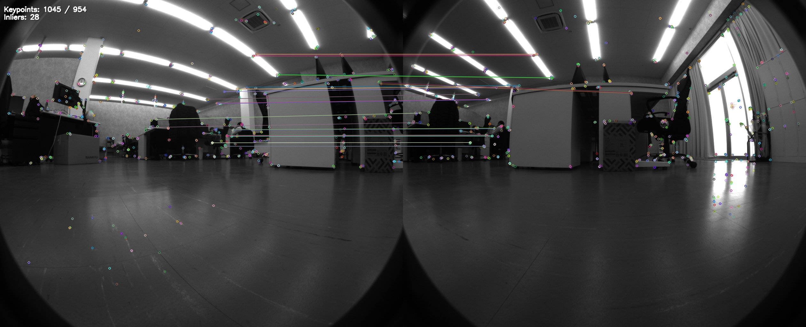|
|SphericalORB256|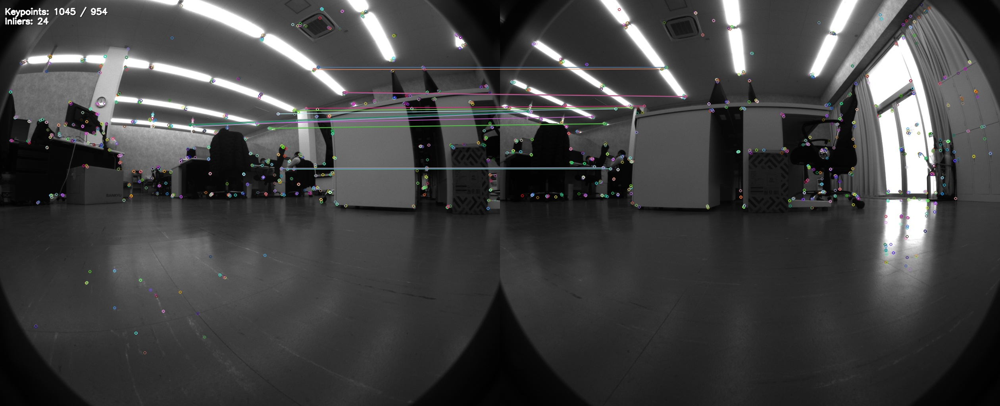|
|AKAZE256|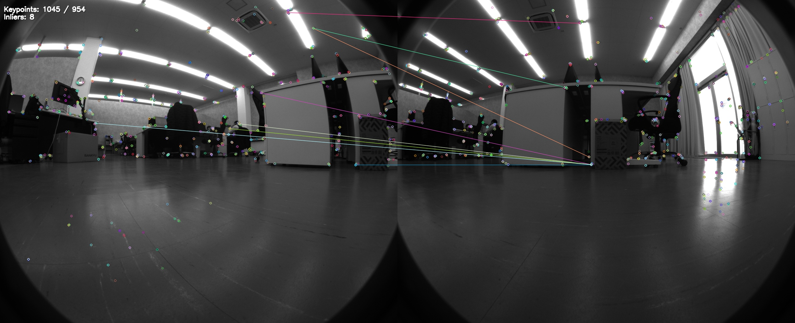|
|SphericalAKAZE256|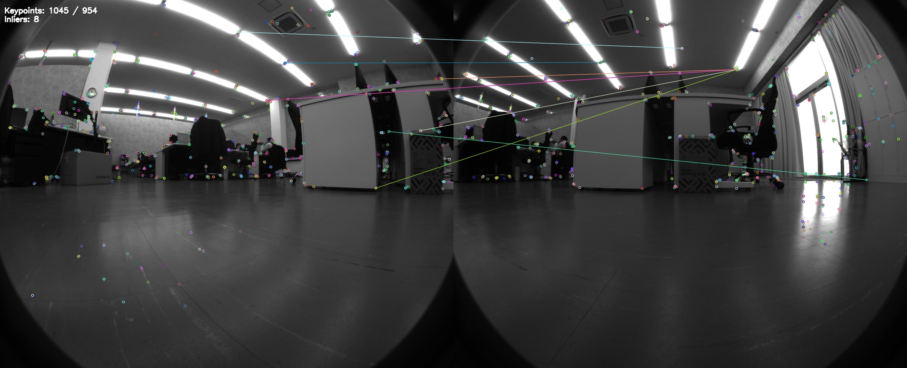|
|BAD256|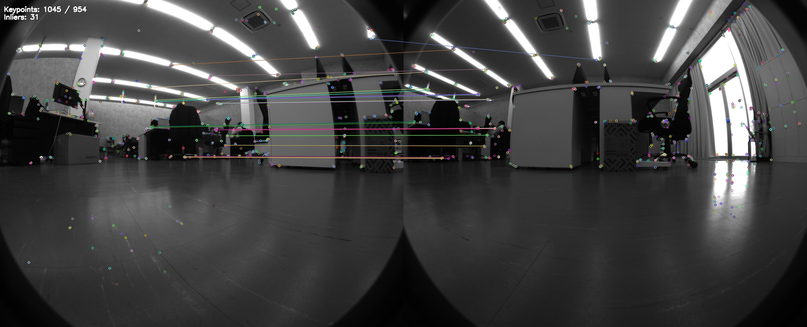|
|SphericalBAD256|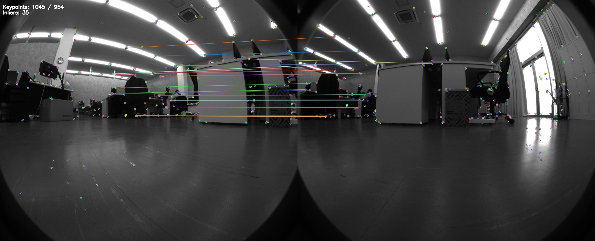|
|BAD512|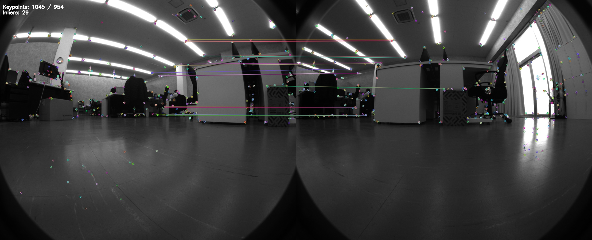|
|SphericalBAD512|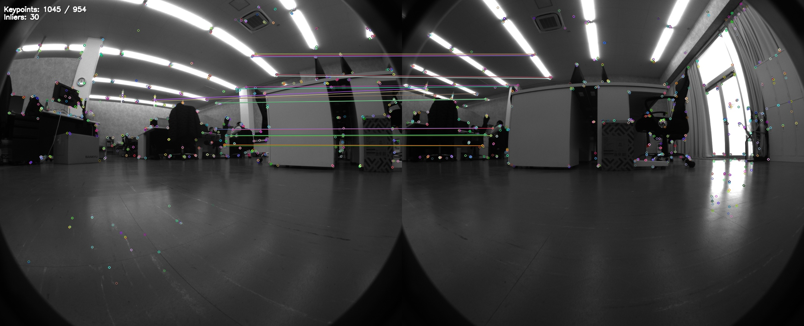|
|HashSIFT256|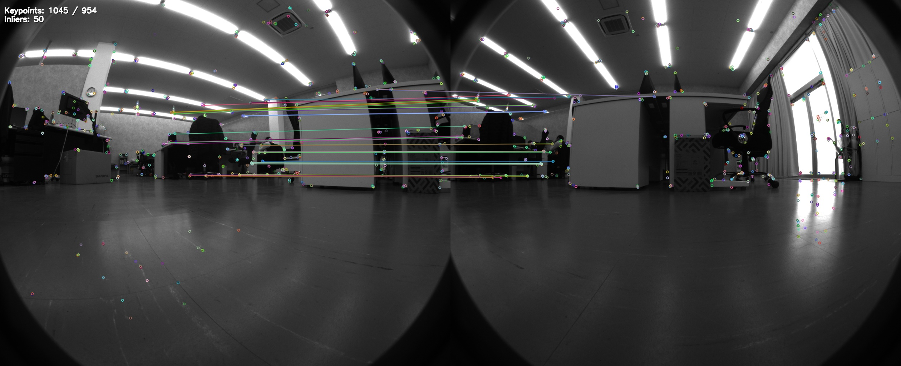|
|SphericalHashSIFT256|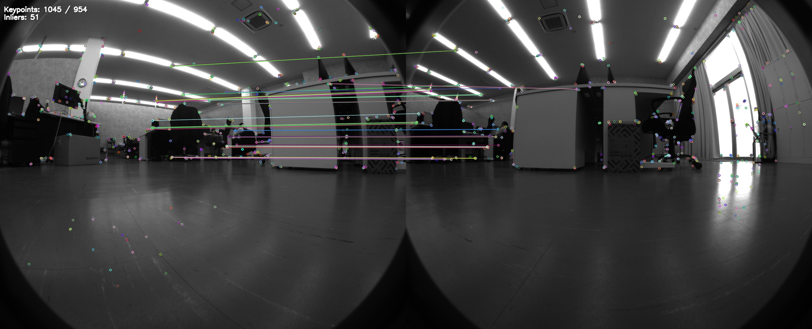|
|HashSIFT512|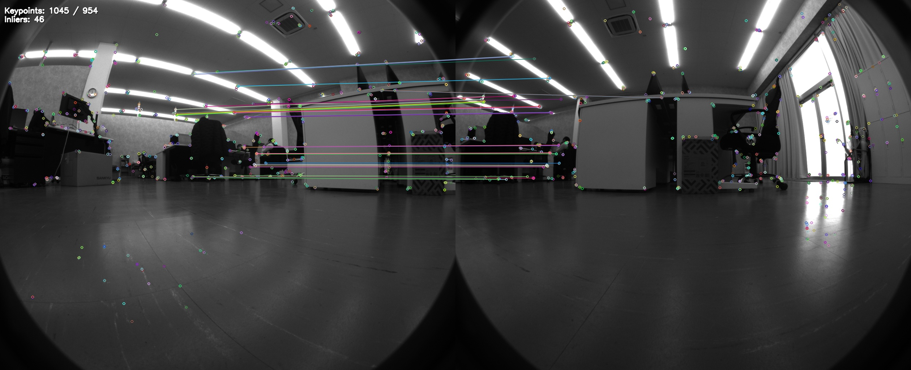|
|SphericalHashSIFT512|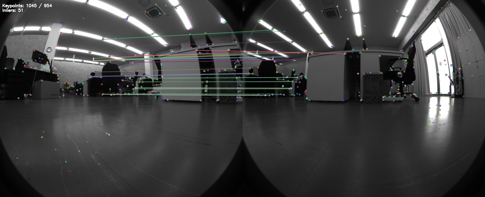|